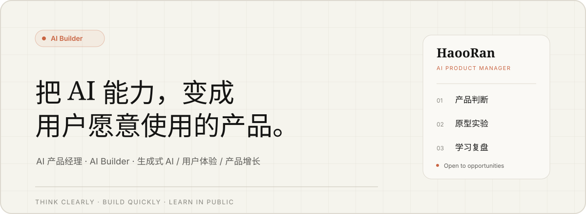

  

  <a href="https://blog.haoran-ai.workers.dev/">个人网站</a>
  &nbsp;·&nbsp;
  <a href="https://blog.haoran-ai.workers.dev/about">关于我</a>
  &nbsp;·&nbsp;
  <a href="https://blog.haoran-ai.workers.dev/#work">项目</a>
  &nbsp;·&nbsp;
  <a href="https://blog.haoran-ai.workers.dev/#writing">文章</a>

## 我是谁 · About

我是 **HaoRan**，一名 **AI Builder**。

我的方向是成为真正理解用户、技术与商业的 AI 产品经理。我关注生成式 AI、用户体验与产品增长，也在持续记录产品拆解、原型实验和学习复盘。

我更愿意用“构建”来理解产品：先找到值得解决的问题，再把模型能力转化为清晰的交互和可验证的方案。

## 精选项目 · Selected work

| 01 · 产品与表达 | 02 · 原生工具 |
| --- | --- |
| **[HaoRan Personal Site](https://github.com/Jaimo-so/haoran-personal-site)** AI 产品经理个人网站与文章管理后台。用长期写作呈现产品判断，用完整页面承接个人品牌。 | **[Jaimo Flow](https://github.com/Jaimo-so/Jaimo-Flow)** 原生、本地优先的 macOS 个人工具站，集成剪贴板、提示词、录音、摄像头检查与应用启动器。 |
| **[个人 IP 配图 Skill](https://github.com/Jaimo-so/personal-ip-illustrations)** 为中文文章生成统一个人形象的正文配图，把内容工作流沉淀成可复用的 Codex Skill。 | **[DeepSeek Usage](https://github.com/Jaimo-so/dsh-deepseek-usage)** DeepSeek 用量与余额插件，用清晰的信息层级呈现余额、Token 消耗和月度趋势。 |

## 我如何工作 · How I work

| 产品判断 | 原型与构建 | 知识沉淀 |
| --- | --- | --- |
| 从用户任务、使用场景和价值链路出发，判断一个 AI 产品为什么成立。 | 把需求与交互思路快速做成可操作原型，用真实体验验证关键路径。 | 把调研、决策和复盘写下来，让每次学习成为下一次实践的起点。 |
| `ChatGPT` · `Perplexity` | `Figma` · `Cursor` · `Codex` | `飞书` · `Obsidian` · `Markdown` |

## 最近思考 · Latest writing

**[AI 产品别只看 MAU：用户介入结构，才能看出 AI 到底帮了多少忙](https://blog.haoran-ai.workers.dev/2026-08-17-dffaoq)**

MAU 能说明有多少人来过，却不能说明任务由谁完成。通过补充信息、结果验证、纠正修改、授权确认与人工接管五类介入，可以看见被任务完成率隐藏的人机分工与用户成本。

## 当前状态 · Now

- 正在持续拆解 AI 产品，把模型能力翻译为用户可理解、可控制、可验证的体验。
- 正在用原型与真实项目训练从需求判断到落地验证的完整产品能力。
- **正在寻找 AI 产品经理机会**，期待交流生成式 AI、用户体验与产品增长。

  
  

  Think clearly · Build quickly · Learn in public

